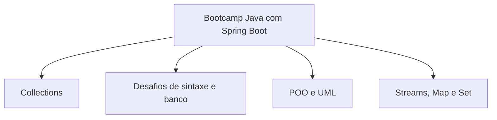

# Bootcamp-java-com-spring-boot

Colecao de desafios e exemplos do Bootcamp Java da DIO organizados em pastas independentes.

## Visao geral

Este repositorio agrupa exercicios de colecoes, POO, streams, map, set, conta bancaria e diagramacao UML.
Cada pasta tem seu proprio codigo fonte, e muitas delas possuem README especifico do desafio.

## Estrutura principal



## Pastas e foco

| Pasta | Foco |
| --- | --- |
| `Conhecendo as Collections` | Ordenacao e manipulacao de objetos em colecoes |
| `Collections com Map` | Estoque de produtos usando `Map` |
| `Operacoes com Set` | Operacoes com conjunto de convidados |
| `Ganhando produtividade com Stream API` | Exemplos e desafios com Stream API |
| `Desafio simulando conta bancaria` | Entrada de dados via terminal para conta bancaria |
| `Desafio.poo.dio` | Modelagem de bootcamp com abstração, heranca e polimorfismo |
| `Explorando serviços de telefonia` | Desafios de logica com cenarios de telefonia |
| `Modelagem e Diagramação de um Componente iPhone` | UML e interfaces do iPhone |
| `desafio.dio.banco` | Modelo de banco com conta corrente e poupanca |

## Como executar

Cada pasta e um mini projeto independente.
Abra a pasta do desafio que quiser rodar e compile os arquivos em `src/`.

Exemplo generico:

```bash
cd "Desafio simulando conta bancaria/ContaBanco"
javac -d bin src/ContaTerminal.java
java -cp bin ContaTerminal
```

## Requisitos

- JDK 11 ou superior.
- VS Code com extensao Java ou qualquer IDE compatível.

## O que este repositorio entrega

- Exercicios prontos para estudo.
- Codigo separado por desafio.
- READMEs especificos em varias pastas com o enunciado original ou adaptado.

## Observacao

Algumas pastas ainda seguem o layout padrao do VS Code Java, com `src/` e `bin/`.
O `bin/` pode ser regenerado a qualquer momento.
